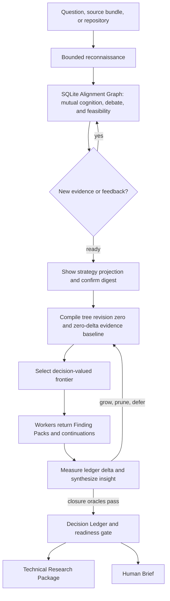

# Research Tree

Evidence-driven technical research for Codex, Claude Code, and Hermes Agent.

`research-tree` turns a vague question, a collection of source material, or an
existing repository into an implementation-ready technical research package.
It does not assume that either the requester or the agent understands the
problem correctly at the start. Instead, it uses bounded reconnaissance,
mutual alignment, feasibility checks, and recursive research to improve the
shared understanding before committing to a design.

This repository contains two related products:

1. **An installable Agent Skill** for Codex, Claude Code, and Hermes Agent.
   The host agent performs the actual research using its available web,
   repository, execution, and delegation capabilities.
2. **A Python artifact runtime** for persisting research rounds and recursive
   tree revisions, selecting the active frontier, replaying unconsumed Finding
   Packs, compiling decisions, and checking readiness.

The Python CLI is not a standalone autonomous research agent. It manages
persisted rounds and research-tree state; source acquisition and agent
execution remain host-owned.

Contributors should read the [development workflow](docs/development-workflow.md).
`master` remains the default and release branch; ordinary development changes
are integrated through pull requests targeting `dev`.

## Why Research Tree?

Most research prompts are incomplete even when they sound specific. Important
constraints, evaluation criteria, operational boundaries, or feasibility facts
are often missing. A conventional research workflow can produce a polished
answer to the wrong question.

Research Tree treats alignment as an ongoing evidence process:

- user statements, agent interpretations, repository observations, and
  external sources remain distinguishable;
- the agent performs lightweight reconnaissance before asking the requester to
  make consequential choices;
- unrealistic combinations of budget, schedule, scope, and quality are tested
  instead of accepted at face value;
- feedback updates the living brief and may revise the research strategy;
- research branches are expanded, merged, superseded, or reopened as the
  evidence changes;
- completion is based on decision closure and implementation readiness, not on
  source count or report length; a closed decision ledger remains
  `delivery_pending` until both deep reports pass the runtime delivery gate.

## What It Produces

Every completed research round has two primary deliverables:

### Technical Research Package

The implementation-facing package records:

- the interpreted outcome, scope, constraints, and unresolved assumptions;
- repository and environment baselines;
- evidence-backed findings with provenance and confidence;
- alternatives, trade-offs, reversals, and rejected directions;
- the recommended architecture and integration boundaries;
- an implementation sequence, validation plan, and readiness assessment.

### Human Research Report

The requester-facing report is persisted as the Human Brief artifact. It is a
professional, evidence-bearing explanation of the recommended direction,
important choices, feasibility limits, uncertainty, and what has actually been
verified. It is not a shallow executive summary.

OpenSpec artifacts are optional and are generated only when explicitly
requested.

## Operating Model



The Alignment Graph is a temporal heterogeneous multigraph backed by SQLite;
it preserves separate human and agent beliefs, parallel evidence relations,
and every state revision. Only explicit confirmation compiles its open research
obligations into Research Tree revision zero. The research tree is an execution
view of the confirmed strategy, not a fixed plan. Intent understanding continues during repository inspection and
deep research. Findings discovered during research can change the brief,
reopen a decision, or replace part of the tree.

The handoff is lossless across the execution boundary: exact validation
oracles, authority, scope, constraints, and evidence-relation paths are carried
into worker actions. Superseded questions are excluded, historical evidence is
deduplicated, and baseline evidence never marks research complete.

The Python runtime makes the long-horizon part executable:
`RecursiveResearchCoordinator` persists each tree revision, exposes the next
bounded frontier, consumes verified Finding Packs, grows successor actions,
targets residual Decision Slot risk, normalizes observed branch complexity,
and recovers results written after a crash. Existing evidence initializes a
zero-delta baseline; repeated evidence does not count as new gain. The host
agent still owns web access, worker processes, and source acquisition.

## Quick Start

### Requirements

- Git
- Python 3.11 or newer
- [uv](https://docs.astral.sh/uv/)
- at least one supported host: Codex, Claude Code, or Hermes Agent

Clone the repository and create the development environment:

```bash
git clone https://github.com/amd2g2zz/research-tree.git
cd research-tree
uv sync
```

Install the package for your host:

```bash
# Codex
uv run research-tree-setup install --host codex --source .

# Claude Code
uv run research-tree-setup install --host claude --source .

# Hermes Agent
uv run research-tree-setup install --host hermes --source .
```

Confirm the installation:

```bash
uv run research-tree-setup status --host all --source .
```

Then invoke the skill from the selected host:

```text
# Codex
$research-tree Investigate how to build a fully autonomous reverse-engineering agent.

# Claude Code
/research-tree Investigate how to build a fully autonomous reverse-engineering agent.

# Hermes Agent
/research-tree Investigate how to build a fully autonomous reverse-engineering agent.
```

The initial request can also include links, local files, prior reports, or a
repository path.

## Installation Instructions for Coding Agents

A coding agent can install this skill on the requester's behalf. The agent must
treat installation as a host-specific operation, not as a generic copy of the
repository.

### Agent Installation Contract

1. Locate the repository root containing `pyproject.toml`, `skill-src/`, and
   `packages/`.
2. Determine the intended host from the active environment or the request:
   `codex`, `claude`, or `hermes`. Do not install all hosts unless requested.
3. Verify that Python 3.11 or newer and `uv` are available.
4. Synchronize the environment and validate the generated packages.
5. Run the installer with `--dry-run` before changing the host's skill
   directory.
6. If the dry run reports `conflict`, stop and report the existing path. Never
   delete or overwrite an unrelated installation.
7. Install only the package selected for the active host. Never install the
   repository root, `skill-src/`, or another host's package.
8. Verify that the final installation status is `current` and that package
   validation still succeeds.
9. Install lifecycle hooks only when the requester explicitly asks for them.
   Merge the host template into existing configuration instead of replacing
   unrelated hooks or settings.

Run the following commands from the repository root, replacing `HOST_NAME`
with `codex`, `claude`, or `hermes`:

```bash
uv sync
uv run python scripts/build_skill_packages.py --check
uv run research-tree-setup install --host HOST_NAME --source . --dry-run
uv run research-tree-setup install --host HOST_NAME --source .
uv run research-tree-setup status --host HOST_NAME --source .
```

The default installation mode is `link`, which keeps the installed skill in
sync with its generated package in this checkout. Use `--mode copy` only when
the requester wants an independent installation or when a link cannot be used.
After installation, start a new host session if the skill is not discovered;
Hermes can reload it immediately with `/reload-skills`.

### Ready-to-Use Agent Prompt

Give the following prompt to a coding agent that has shell access to the cloned
repository:

```text
Install Research Tree for your active agent host from this repository.

- Identify whether the host is Codex, Claude Code, or Hermes Agent.
- Use only that host's package under packages/.
- Run uv sync and validate all generated packages before installation.
- Run research-tree-setup install with --dry-run first.
- Do not overwrite an existing conflicting skill directory.
- Perform the installation, then run research-tree-setup status.
- Finish only when the selected host reports status "current" and package
  validation succeeds. Report the installed package path and target path.
- Do not enable lifecycle hooks unless I explicitly request them.
```

## Host-Specific Packages

Each host receives an isolated, self-contained package. The packages share the
research method and artifact templates, but their host metadata and runtime
adaptation are intentionally different.

| Host | Package | User installation | Project installation | Explicit invocation |
| --- | --- | --- | --- | --- |
| Codex | `packages/codex/research-tree` | `$CODEX_HOME/skills/research-tree` (defaults to `~/.codex/skills/research-tree`) | `.agents/skills/research-tree` | `$research-tree ...` |
| Claude Code | `packages/claude-code/research-tree` | `~/.claude/skills/research-tree` | `.claude/skills/research-tree` | `/research-tree ...` |
| Hermes Agent | `packages/hermes/research-tree` | `~/.hermes/skills/research-tree` | Configure `skills.external_dirs` | `/research-tree ...` |

The formats are not interchangeable:

- **Codex** uses the strict `SKILL.md` metadata contract and ships UI metadata
  in `agents/openai.yaml`.
- **Claude Code** uses Claude-specific invocation controls in `SKILL.md`,
  including `argument-hint`, `disable-model-invocation`, and
  `user-invocable`.
- **Hermes Agent** uses minimal Agent Skills metadata plus a dedicated runtime
  adapter and compatibility reference. It does not assume that LangGraph or
  LangChain is installed.

Do not install the repository root or copy one host package into another
host's skill directory.

### User-question capabilities

The skill never assumes that a question tool from another host exists. It uses
the native capability when exposed and falls back to ordinary conversation
otherwise:

| Host | Native structured question capability | Availability boundary |
| --- | --- | --- |
| Codex | Experimental `request_user_input` app-server request | Conditional; not guaranteed in Skill shells or non-interactive `codex exec` |
| Claude Code | `AskUserQuestion` | Session-dependent; Agent SDK sessions must include it in `tools` and handle `canUseTool` |
| Hermes Agent | `clarify` in the `clarify` toolset | Present in `hermes-cli`/most gateways; removed from `hermes-acp` and `hermes-api-server` |

See the host compatibility references for the exact schemas and fallbacks:
[Codex](packages/codex/research-tree/references/codex-cli-compatibility.md),
[Claude Code](packages/claude-code/research-tree/references/claude-code-compatibility.md),
and [Hermes](packages/hermes/research-tree/references/hermes-agent-compatibility.md).

## Installation Options

The setup command defaults to a user-scoped link installation. On Windows it
falls back to a directory junction when a symbolic link cannot be created.
Use `--mode copy` when you need an independent copy.

Install all supported user packages in one operation:

```bash
uv run research-tree-setup install --host all --source .
```

Install Codex or Claude Code into another project:

```bash
uv run research-tree-setup install \
  --host codex \
  --scope project \
  --project-root ../another-project \
  --source .
```

Hermes does not have a native project skill directory. To load the checked-in
Hermes package without copying it, add its package parent to
`~/.hermes/config.yaml`:

```yaml
skills:
  external_dirs:
    - /absolute/path/to/research-tree/packages/hermes
```

Run `/reload-skills` in Hermes after changing the configuration.

### Hermes provider-failure diagnosis

Hermes loads a skill on demand. The Hermes package therefore uses a compact
entrypoint and loads alignment, execution, and delivery guidance by phase. Run
the package preflight before the first session:

```bash
python packages/hermes/research-tree/scripts/hermes_skill_adapter.py validate \
  --skill-dir packages/hermes/research-tree --mode external-dir
python packages/hermes/research-tree/scripts/hermes_skill_adapter.py doctor \
  --skill-dir packages/hermes/research-tree
```

If the gateway reports `The model provider failed after retries`, run `doctor`
with the real Hermes home. It reports only a sanitized category such as
`context_limit`, `authentication`, `rate_limit`, `network_or_timeout`, or
`malformed_or_empty_stream`; raw provider responses and credentials remain in
Hermes' gateway log:

```bash
python packages/hermes/research-tree/scripts/hermes_skill_adapter.py doctor \
  --skill-dir ~/.hermes/skills/research-tree --hermes-home ~/.hermes
```

`prompt_risk.level: high` means the installed package is too large for reliable
cross-provider loading. Use the current Hermes package and run `/reload-skills`
after replacing an older installation.

The installer performs a preflight check and refuses to overwrite an unrelated
existing skill directory. Use `--dry-run` to inspect the planned operation.

## Optional Lifecycle Hooks

The repository includes opt-in lifecycle hooks for recording when a supported
agent session starts and stops. They are not required for the Research Tree
skill and are not installed automatically. Hook commands run with the user's
credentials, so review and enable them deliberately.

The shared hook records only sanitized lifecycle metadata:

- host and event name;
- timestamp;
- repository-relative working directory;
- bounded session, turn, and agent identifiers when supplied by the host.

It does not persist prompts, tool inputs, transcripts, model responses, or
environment variables. Events are written atomically under
`.research-tree-hooks/events/`; that runtime directory is ignored by Git, while
the source and templates under `hooks/` are tracked.

| Host | Template | Configuration target |
| --- | --- | --- |
| Codex | `hooks/codex.hooks.template.json` | Project `.codex/hooks.json` |
| Claude Code | `hooks/claude-code.settings.template.json` | Merge its `hooks` object into `.claude/settings.json` |
| Hermes Agent | `hooks/hermes.config.template.yaml` | Merge its `hooks` entries into `~/.hermes/config.yaml` |

For Codex, copy the template only when the target file does not already exist.
If it exists, merge the `SessionStart` and `Stop` arrays with the existing
`hooks` object. For Claude Code, preserve every existing settings key and merge
only the two Research Tree hook groups. For Hermes, preserve the existing YAML
configuration and keep first-use consent enabled; then inspect the result with
`hermes hooks doctor`.

All templates invoke the checked-out runtime through:

```bash
uv run --locked research-tree-hook --host HOST_NAME --event EVENT_NAME
```

The command must run inside this checkout so `uv` can resolve the project and
the observer can confine output to the repository. A malformed payload,
unsupported event, timeout, or filesystem error fails open and never blocks the
agent session.

## Optional Debug Trace

For a difficult workflow diagnosis, enable a bounded trace from the source
checkout. It records phase, status, host, timestamp, and approved reason codes;
it never records prompts, responses, tool input, repository content, or
environment variables.

```bash
uv run --locked research-tree-debug emit \
  --host codex --phase alignment_blocked --status blocked \
  --code missing-success-oracle
uv run --locked research-tree-debug summary --limit 50
```

Trace files are atomically stored under `.research-tree-debug/events/` and are
ignored by Git. The research skill emits these only when diagnostic tracing is
explicitly requested and the source runtime is available. To debug an optional
lifecycle hook, temporarily append `--debug` to its command; it remains
fail-open and writes only sanitized setup errors to stderr.

## Repository Layout

```text
research-tree/
|-- packages/              # Generated, installable host packages
|   |-- codex/
|   |-- claude-code/
|   `-- hermes/
|-- skill-src/             # Shared authoring template and host overlays
|-- assets/                # Living Brief and report templates
|-- references/            # Research method and product contracts
|-- src/research_tree/     # Python artifact runtime
|-- scripts/               # Package builder and Hermes adapter tooling
|-- hooks/                 # Optional host lifecycle hook templates
|-- tests/                 # Runtime, packaging, installation, and E2E tests
|-- PRODUCT.md             # Product specification
`-- pyproject.toml         # Python package and CLI entry points
```

The files under `packages/` are generated artifacts. Edit the corresponding
source under `skill-src/`, `assets/`, `references/`, or `scripts/`, then rebuild
the packages.

## Python Runtime

The `research_tree` package provides composable services for applications that
need persisted and validated research artifacts. Its public API includes:

- `RunStore` for isolated, reconstructable research rounds;
- `AlignmentGraphStore` for SQLite-backed, replayable pre-handoff cognition;
- context intake and repository safety policies;
- intent, Working Brief, Blueprint Target, and work-item compilers;
- finding and Decision Ledger compilation;
- persisted recursive-tree selection, ingestion, and crash recovery;
- readiness, assurance, verification, and evaluation contracts;
- Technical Research Package and Human Brief delivery;
- feedback rounds and opt-in OpenSpec export.

The command-line interface exposes alignment handoff compilation, round
management, persisted recursive-tree initialization, frontier selection,
Finding Pack ingestion, and crash
recovery. Use the `research_tree` Python API for composed workflow services.

```bash
STORE=.research-tree-demo

uv run python -m research_tree create-round \
  --store "$STORE" \
  --round-id round-first

uv run python -m research_tree show-round \
  --store "$STORE" \
  --round-id round-first

uv run python -m research_tree tree-init \
  --store "$STORE" \
  --round-id round-first \
  --decision-slots ./decision-slots.json

# Or compile a confirmed local Alignment Graph directly into revision zero.
# The round above must already exist.
uv run python -m research_tree tree-init-alignment \
  --store "$STORE" \
  --round-id round-first \
  --alignment-db .research-tree-alignment/run-001/alignment.db

uv run python -m research_tree tree-next \
  --store "$STORE" \
  --round-id round-first

uv run python -m research_tree tree-ingest \
  --store "$STORE" \
  --round-id round-first \
  --finding finding-001

uv run python -m research_tree tree-recover \
  --store "$STORE" \
  --round-id round-first

# Completion requires both persisted, non-shallow reports.
uv run python -m research_tree tree-deliver \
  --store "$STORE" \
  --round-id round-first \
  --technical-report ./technical-research-package.md \
  --human-report ./human-research-report.md
```

Use the same `--store` path to reconstruct a round after restarting the
process. Creating an existing round ID is rejected instead of overwriting its
state.

See [`src/research_tree/__init__.py`](src/research_tree/__init__.py) for the
public API and [`tests/test_e2e_blueprint.py`](tests/test_e2e_blueprint.py) for
the composed delivery path.

## Development

Rebuild all host packages after changing the skill template, shared resources,
or a host adapter:

```bash
uv run python scripts/build_skill_packages.py
```

Verify that checked-in packages are current and isolated correctly:

```bash
uv run python scripts/build_skill_packages.py --check
```

Run the full test suite:

```bash
uv run pytest -q
```

Package validation checks that:

- generated files match their authoring sources;
- every referenced resource exists;
- each package contains only its expected files;
- Claude Code metadata does not leak into Codex or Hermes;
- Codex UI metadata does not leak into Claude Code or Hermes;
- Hermes compatibility files remain Hermes-only.

## Documentation

- [Product specification](PRODUCT.md)
- [Skill authoring template](skill-src/SKILL.template.md)
- [Codex package](packages/codex/research-tree/SKILL.md)
- [Claude Code package](packages/claude-code/research-tree/SKILL.md)
- [Hermes package](packages/hermes/research-tree/SKILL.md)
- [Research quality playbook](references/research-quality-playbook.md)
- [Product contracts](references/product-contracts.md)
- [Blueprint generation research](references/blueprint-generation-research.md)
- [Hermes compatibility notes](references/hermes-agent-compatibility.md)

## Project Status

The repository currently ships usable host-specific skill packages and an
implemented Python artifact runtime. The host agent is still responsible for
web access, repository inspection, tool execution, model calls, and worker
delegation. There is no standalone command that autonomously performs an entire
research run outside a supported agent host.
