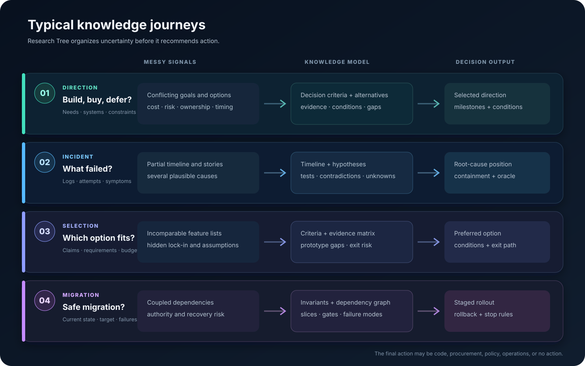

# Research Tree

**Evidence-driven research and decision workflows for AI agents.**

Turn an uncertain question, mixed source material, or a changing brief into
traceable findings, explicit decisions, and handoff-ready research.

[Quick start](#quick-start) · [Typical cases](#typical-research-cases) ·
[For agents](docs/guides/agent.md) · [Documentation](docs/README.md)

Research Tree is a portable Skill that gives an AI agent a disciplined way to
research consequential questions. It works inside Codex, Claude Code, and
Hermes Agent today, but it is not limited to coding agents or coding tasks.
Use it for technical and product strategy, incident investigation, tool or
vendor selection, security review, migration planning, and implementation
research.

## Why Research Tree

AI agents can produce answers quickly. Hard decisions need more than a fluent
answer: they need a shared understanding of the question, evidence that can be
checked, visible uncertainty, and a result that another human or agent can
continue without reconstructing the entire conversation.

| Align the question | Build the knowledge | Make the decision usable |
| --- | --- | --- |
| Clarifies outcome, scope, authority, constraints, and success signals. | Maps decision gaps, investigates in bounded tracks, and preserves provenance and counterevidence. | Produces a human-readable recommendation and a structured package for downstream agents. |

Research Tree treats corrections as model updates, not comments appended to a
finished answer. Unknown outcomes remain unknown. A stopped worker, a polished
report, or a long source list does not automatically count as completion.

## Typical Research Cases

| Starting situation | Knowledge Research Tree builds | Decision-ready result |
| --- | --- | --- |
| **Product and technical direction** — “Should this capability be built, bought, or postponed?” | User need, constraints, viable options, dependency map, cost and risk evidence. | A selected direction, rejected alternatives, conditions, and validation milestones. |
| **Incident investigation** — “Why does this release path intermittently publish stale artifacts?” | Timeline, competing hypotheses, repository and runtime evidence, disproved causes, residual uncertainty. | A root-cause position, containment actions, durable fixes, and tests that distinguish recurrence. |
| **Tool or vendor selection** — “Which search stack fits our data, privacy, and operating budget?” | Evaluation criteria, source-backed capability matrix, lock-in and migration risks, proof-of-concept evidence. | A recommendation with confidence, decision conditions, and an exit strategy. |
| **Risky migration planning** — “How can we move this workflow without losing authority or recoverability?” | Current-state map, invariants, dependency graph, failure modes, rollout and rollback evidence. | A staged migration plan with gates, ownership, observability, and stop conditions. |

See [Typical research journeys](docs/guides/use-cases.md) for complete prompts,
knowledge-flow diagrams, expected artifacts, and examples that do not assume
the final action is code.

## What You Get

Research Tree produces two views of the same evidence and decision state:

| Deliverable | Primary reader | Contents |
| --- | --- | --- |
| **Human Research Report** | Requester, decision owner, reviewer | The recommendation in plain language, why it is supported, what changed during research, and what still needs a human decision. |
| **Technical Research Package** | Research agent, implementation agent, auditor | Scope, evidence ledger, findings, alternatives, decision map, risks, implementation or operating plan, validation, and unresolved conditions. |

OpenSpec conversion is optional and happens only when explicitly requested.
Research does not silently become implementation authority.

## Quick Start

### 1. Prepare the repository

~~~bash
git clone https://github.com/amd2g2zz/research-tree.git
cd research-tree
uv sync
~~~

Requirements: Git, Python 3.11+, [uv](https://docs.astral.sh/uv/), and at
least one supported agent host.

Research Tree also provides a Python API for composed workflow services when
you need to embed its governed research workflow in another agent or
application.

### 2. Install for a host

~~~bash
# Choose one: codex, claude, or hermes
uv run --frozen research-tree-setup install --host codex --source .
uv run --frozen research-tree-setup status --host codex --source .
~~~

Setup installs the selected Skill and its global lifecycle hooks. The hooks
remain inert unless a Research Tree project/run binding is active. The status
command verifies both the payload digest and setup-managed hook state. For copy
installs, host-specific configuration, lifecycle diagnostics, and safe update
guidance, see the [operator guide](docs/guides/operator.md).

### 3. Ask a consequential question

~~~text
# Product and technical direction
$research-tree We are considering a shared customer-identity service.
Clarify the decision, inspect the current systems and constraints, compare
build/buy/defer options, and produce a recommendation with validation gates.

# Incident research
/research-tree Investigate why this release path intermittently publishes
stale artifacts. Build and test competing hypotheses before recommending fixes.

# Vendor selection
/research-tree Compare these three managed search services for our privacy,
latency, staffing, and exit requirements. Keep assumptions and missing evidence
visible, and recommend a decision process as well as a preferred option.
~~~

Start with what you have: a question, repository, links, documents, logs,
screenshots, constraints, previous attempts, or an incomplete brief. Research
Tree will ask only for the missing information that can materially change the
research strategy.

## How The Knowledge Evolves

~~~mermaid
flowchart LR
    A[Question + context] --> B[Living understanding]
    B --> C[Decision map]
    C --> D[Bounded research tracks]
    D --> E[Evidence + finding packs]
    E --> F[Decision ledger]
    F --> G[Human Research Report]
    F --> H[Technical Research Package]
    I[User correction] --> B
    J[New contradiction] --> C
~~~

The agent and requester co-evolve the working understanding until the outcome,
scope, authority, and success signal are usable. After handoff, research can
continue autonomously within that boundary. New evidence or feedback can reopen
the decision map; it does not get buried in a final narrative.

## Choose Your Path

| You are... | Start here |
| --- | --- |
| **A requester or decision owner** | Read the [typical cases](docs/guides/use-cases.md), then start with a real question. |
| **An AI agent using the Skill** | Use the [Agent guide](docs/guides/agent.md) to load the minimum authoritative context and avoid historical or generated sources. |
| **An operator installing or diagnosing hosts** | Use the [Operator guide](docs/guides/operator.md) for install, doctor, lifecycle, hooks, and debug commands. |
| **A contributor or reviewer** | Use the [Documentation hub](docs/README.md), [product specification](PRODUCT.md), and [development workflow](docs/contributing/development-workflow.md). |

## Supported Hosts

| Host | Install | Invoke |
| --- | --- | --- |
| Codex | <code>research-tree-setup install --host codex --source .</code> | <code>$research-tree ...</code> |
| Claude Code | <code>research-tree-setup install --host claude --source .</code> | <code>/research-tree ...</code> |
| Hermes Agent | <code>research-tree-setup install --host hermes --source .</code> | <code>/research-tree ...</code> |

Claude Code also supports the repository marketplace:

~~~bash
claude plugin marketplace add amd2g2zz/research-tree
claude plugin install research-tree@research-tree
~~~

The packages are host-specific and are not interchangeable. The selected host
provides model access, tools, web or repository access, and worker mechanics.
Research Tree supplies the research method, durable coordination, evidence
boundary, and shared completion semantics.

## Stable Lifecycle Interface

The Skill is the normal interaction surface. Operators and integrating agents
can also use the stable host-neutral CLI:

~~~bash
uv run --frozen research-tree doctor --host all --source /path/to/research-tree

uv run --frozen research-tree run \
  --workspace /path/to/workspace --host codex \
  --project-id strategy --run-id strategy-001 \
  --outcome "recommend a supportable direction" \
  --scope "provided sources, current systems, and operating constraints" \
  --authority "research and recommendation only" \
  --success-oracle "traceable evidence, explicit alternatives, reviewable decision"

uv run --frozen research-tree status \
  --workspace /path/to/workspace --host codex \
  --project-id strategy --run-id strategy-001
~~~

The CLI hides internal persistence and event schemas behind versioned JSON
responses. A prepared run is durable state, not permission to broaden scope,
perform an implementation, or claim completion.

## Evidence And Authority Boundary

- Findings retain provenance, confidence, limitations, and counterevidence.
- Corrections supersede stale assumptions and invalidate dependent handoffs.
- Interrupted attempts remain distinguishable from verified completion.
- Host labels and process exits are observations, not final authority.
- Consequential implementation, purchasing, policy, or operational changes
  remain subject to the authority named by the requester.

Research Tree is currently released as Alpha2. Formal benchmarks and
organizational-adoption studies continue as separate evidence tracks; they are
not implied by a successful installation or local test run.

## Documentation

The [Documentation hub](docs/README.md) separates active guidance from
architecture decisions, historical specifications, evaluation material, and
generated host packages. Agents should begin with the
[Agent guide](docs/guides/agent.md), not recursively load the entire repository.

- [Product specification](PRODUCT.md)
- [Typical research journeys](docs/guides/use-cases.md)
- [Agent guide](docs/guides/agent.md)
- [Operator guide](docs/guides/operator.md)
- [Architecture decisions](docs/adr/)
- [Development workflow](docs/contributing/development-workflow.md)
- [Documentation authority](docs/governance/documentation-authority.md)

To develop the Skill, edit canonical sources under <code>skill-src/</code>,
<code>assets/</code>, <code>references/</code>, <code>scripts/</code>, or
<code>src/</code>; generated packages live under <code>packages/</code>.

~~~bash
uv run --frozen python scripts/build_skill_packages.py --check
uv run --frozen python scripts/check_docs.py
uv run --frozen pytest -q
~~~
