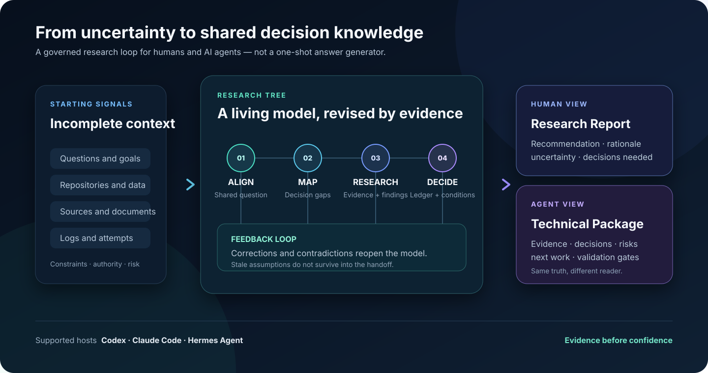
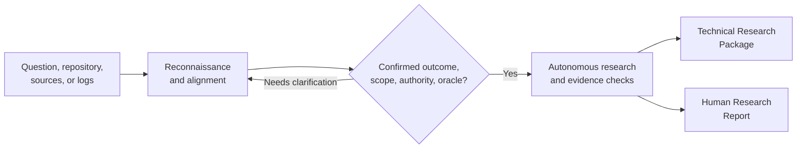

# Research Tree

**Turn an unclear technical problem into a research-backed implementation plan.**

Research Tree is an agent Skill for **Codex**, **Claude Code**, and **Hermes
Agent**. Give it a question, repository, links, logs, or prior notes. It
investigates the context with you, confirms the important boundaries, then
performs autonomous technical research and returns two deliverables that a
human and an implementation agent can act on.



## What You Get

| Deliverable | Use it for |
| --- | --- |
| **Technical Research Package** | Architecture, trade-offs, source-backed findings, implementation steps, validation plan, and open risks. |
| **Human Research Report** | A plain-language explanation of the recommendation, what changed, what was verified, and what still needs a decision. |

The skill does not treat a polished answer, a long source list, or a stopped
subagent as completion. It keeps evidence, assumptions, authority, and
unresolved risks visible until the agreed decision and delivery checks are met.

## Use It When

- a request is vague, high-risk, or mixes product intent with technical choices;
- you need to understand an unfamiliar repository before proposing a change;
- multiple sources disagree and you need a defensible recommendation;
- a team needs research that survives handoff, correction, interruption, and review;
- you want an implementation agent to start from evidence rather than rediscovering the problem.

It is **not** a replacement for a host model, web access, or human approval of
consequential implementation. Your selected host supplies those capabilities;
Research Tree supplies the research method, durable coordination, and evidence
boundary.

## Start In Three Steps

### 1. Get the source and `uv`

```bash
git clone https://github.com/amd2g2zz/research-tree.git
cd research-tree
uv sync
```

Requirements: Git, Python 3.11+, [uv](https://docs.astral.sh/uv/), and at
least one supported host.

### 2. Install for your host

```bash
# Choose one: codex, claude, or hermes
uv run --frozen research-tree-setup install --host codex --source .
uv run --frozen research-tree-setup status --host codex --source .
```

Use `--mode copy` when a symlink/junction is unsuitable. The status command
verifies the installed payload by digest; it does not rely only on its path.

### 3. Ask a real research question

```text
# Codex
$research-tree We need to add multi-tenant audit logs. Inspect this repository,
identify the safest architecture, migration path, and validation plan.

# Claude Code direct Skill
/research-tree Investigate why our release pipeline intermittently publishes
stale artifacts. Use the repository and recent logs; recommend a safe fix.

# Hermes Agent
/research-tree Compare the three authentication designs in these links and
this repository. Produce an implementation-ready recommendation.
```

Start with the information you have. A repository path, links, local files,
logs, screenshots, constraints, and an imperfect goal are all useful input.

## What The Experience Looks Like



Before autonomous work, the skill clarifies the outcome, scope, authority, and
success signal. After explicit handoff, it can inspect sources, create a
research strategy, use available host-native workers, recover interrupted work,
and revise the plan when evidence changes. A correction from you updates the
working model; it is not merely appended to a report.

## Pick Your Host

| Host | Install | Invoke | Notes |
| --- | --- | --- | --- |
| Codex | `research-tree-setup install --host codex --source .` | `$research-tree ...` | Installs a Codex Skill. |
| Claude Code | `research-tree-setup install --host claude --source .` | `/research-tree ...` | Direct-Skill compatibility install. The marketplace option is below. |
| Hermes Agent | `research-tree-setup install --host hermes --source .` | `/research-tree ...` | For a project path, configure `skills.external_dirs`; see [Hermes setup](#hermes-agent). |

All examples run from the repository checkout through the `uv`-managed Python
environment. Do not run the bundled Python scripts with an arbitrary system
`python` executable.

### Claude Code Marketplace

Claude Code can install the generated plugin through this repository's
marketplace instead of the direct-Skill compatibility path:

```bash
claude plugin marketplace add amd2g2zz/research-tree
claude plugin install research-tree@research-tree
claude plugin validate packages/claude-code/research-tree --strict
```

Then invoke `/research-tree:research-tree ...`. Run `/reload-plugins` after
updating a local marketplace checkout.

### Hermes Agent

Hermes has no native project Skill directory. To use the package from this
checkout without copying it, add its parent directory to
`~/.hermes/config.yaml`:

```yaml
skills:
  external_dirs:
    - /absolute/path/to/research-tree/packages/hermes
```

Run `/reload-skills` after changing the configuration. For a provider failure,
use the packaged diagnostic command rather than treating a process exit code as
proof that the model turn succeeded:

```bash
uv run --frozen python packages/hermes/research-tree/scripts/hermes_skill_adapter.py doctor \
  --skill-dir packages/hermes/research-tree
```

## For Operators: Stable Lifecycle CLI

The host Skill is the normal entry point. The repository also ships a stable,
host-neutral CLI for installation and durable run coordination. It hides
internal database paths and event schemas behind versioned JSON responses.

```bash
# Verify installation and host readiness.
uv run --frozen research-tree doctor --host all --source /path/to/research-tree

# Create a bounded research request in a project workspace.
uv run --frozen research-tree run \
  --workspace /path/to/project --host codex \
  --project-id audit-logs --run-id audit-logs-001 \
  --outcome "recommend an audit-log architecture" \
  --scope "repository design and migration plan" \
  --authority "research only" \
  --success-oracle "independent evidence and review receipt"

# Inspect or resume the same durable request.
uv run --frozen research-tree status \
  --workspace /path/to/project --host codex \
  --project-id audit-logs --run-id audit-logs-001
```

`run` prepares durable, non-authoritative state. It never grants permission to
broaden scope, execute an implementation, or claim completion without the
required evidence and review.

## What Research Tree Preserves

| Concern | Behavior |
| --- | --- |
| **Changing requirements** | Corrections supersede stale assumptions and invalidate dependent handoffs. |
| **Evidence** | Findings retain provenance, confidence, limits, and counterevidence. |
| **Long research** | A durable coordinator preserves revisions, checkpoints, readiness, and recovery state. |
| **Host differences** | Codex, Claude Code, and Hermes receive isolated packages but share canonical completion semantics. |
| **Interrupted work** | Unknown outcomes stay unknown; retries use new attempts rather than silently reusing a stopped worker. |
| **Review** | Completion is gated by the canonical coordinator and independent evidence, not a host task label alone. |

Optional lifecycle hooks and debug traces are available for operators, but they
are not installed or enabled by default. See [hooks](#optional-lifecycle-hooks)
and [debugging](#debug-tracing) below.

## Installation Details

The normal installer is deliberately conservative: run `--dry-run` before a
first install, do not overwrite an unrelated target, and verify the final
status is `current`.

```bash
uv run --frozen python scripts/build_skill_packages.py --check
uv run --frozen research-tree-setup install --host claude --source . --dry-run
uv run --frozen research-tree-setup install --host claude --source .
uv run --frozen research-tree-setup status --host claude --source .
```

| Host | User installation | Project installation |
| --- | --- | --- |
| Codex | `$CODEX_HOME/skills/research-tree` | `.agents/skills/research-tree` |
| Claude Code | `~/.claude/skills/research-tree` | `.claude/skills/research-tree` |
| Hermes Agent | `~/.hermes/skills/research-tree` | `skills.external_dirs` configuration |

The host packages are isolated and not interchangeable. Do not install the
repository root or copy a package for one host into another host's Skill path.

## Optional Lifecycle Hooks

Hooks record only sanitized lifecycle metadata such as the host, event name,
timestamp, workspace, and bounded host identifiers. They never record prompts,
model responses, tool inputs, or environment variables. Enable them only after
reviewing the host-specific template:

| Host | Template | Configuration target |
| --- | --- | --- |
| Codex | `hooks/codex.hooks.template.json` | `.codex/hooks.json` |
| Claude Code | `hooks/claude-code.settings.template.json` | `.claude/settings.json` |
| Hermes Agent | `hooks/hermes.config.template.yaml` | `~/.hermes/config.yaml` |

Hook commands must run from this checkout through `uv` so they use the
repository-managed environment. They fail open and do not block an agent
session.

## Debug Tracing

For a difficult workflow diagnosis, enable a bounded trace explicitly:

```bash
uv run --frozen research-tree-debug emit \
  --host codex --phase alignment_blocked --status blocked \
  --code missing-success-oracle
uv run --frozen research-tree-debug summary --limit 50
```

Traces contain approved reason codes and limited metadata only. They are stored
under an ignored local directory and are not a source of completion authority.

## Develop The Skill

The editable sources live in `skill-src/`, `assets/`, `references/`, `scripts/`,
and `src/`. `packages/` and `.claude-plugin/` are generated distributions.

```bash
uv run --frozen python scripts/build_skill_packages.py
uv run --frozen python scripts/build_skill_packages.py --check
uv run --frozen pytest -q
```

For contributor workflow and release promotion, see
[development workflow](docs/development-workflow.md). `dev` is the integration
branch; `master` is the release branch.

## Documentation And Status

- [Product specification](PRODUCT.md)
- [Architecture decisions](docs/adr/)
- [Documentation authority model](docs/documentation-authority.md)
- [Evaluation asset governance](docs/evaluation-assets.md)
- [Codex package](packages/codex/research-tree/SKILL.md)
- [Claude Code package](packages/claude-code/research-tree/skills/research-tree/SKILL.md)
- [Hermes package](packages/hermes/research-tree/SKILL.md)
- [Research quality playbook](references/research-quality-playbook.md)

Research Tree currently ships Alpha2 host packages and the canonical Python
runtime. The host remains responsible for model access, web access, repository
inspection, tool execution, and any user-approved implementation. Formal
benchmark and organizational-adoption evaluation continue separately from
normal rolling releases; they are not implied by a successful installation or
local test run.
